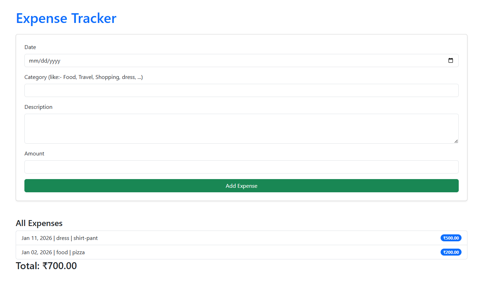

# Expense Tracker 🧾

A full-stack Django web app where every user creates their own account and tracks their own expenses. Data is stored in a database and stays there until the user deletes it.



## 🚀 Features

**Design**
- Modern responsive UI: sidebar layout, hero banner, stat cards, charts, progress ring
- Light and dark theme (remembers your choice), mobile menu and floating "add" button
- Styled confirmation pop-ups, auto-hiding messages, colour-coded categories
- Custom CSS/JS only (`expenses/static/expenses/`) - no UI framework needed

**Accounts**
- Sign up, login and logout (each user only ever sees their own data)
- Forgot password by email, change password
- Profile page (name, email) and permanent account deletion (password required)
- Stay logged in for 30 days

**Expenses**
- Add, edit and delete expenses (date, category, optional description, amount in ₹)
- Payment mode for every expense: **Offline (cash)** or **Online**, and for online payments the app or method used (Google Pay, PhonePe, Paytm, BHIM, Navi, YONO SBI, Amazon Pay, card, UPI, bank...)
- Search, filter by category, payment mode, app and date range, and pagination
- Export your expenses to CSV (opens in Excel)
- Delete all of *your* expenses (never other users' data)

**Dashboard**
- This-month total, all-time total and entry count
- Spending-by-category chart and 6-month trend chart
- "How you paid" breakdown: online vs offline and each app's share
- Monthly budget with a progress bar and over-budget warning

**Security & production**
- CSRF-protected, POST-only deletes; per-user data isolation
- Environment-variable configuration, WhiteNoise static files, PostgreSQL support
- Health check endpoint (`/healthz/`), custom 404/500 pages, automated tests

## 🛠 Tech Stack
- Backend: Python, Django
- Frontend: HTML, custom CSS/JS design system, Chart.js
- Database: SQLite locally, PostgreSQL in production
- Deployment: Render, Gunicorn, WhiteNoise

## 📂 Project Structure
```
expense_tracker/
├── expense_tracker/      # project settings, urls, wsgi
├── expenses/             # app: models, views, forms, templates, tests
│   ├── migrations/
│   └── templates/
├── screenshots/          # README images
├── manage.py
├── requirements.txt
├── Procfile
└── README.md
```

## ⚙️ Run locally

```bash
git clone https://github.com/ethicalvishal/Expense_Tracker.git
cd Expense_Tracker

python -m venv venv
venv\Scripts\activate          # Windows
# source venv/bin/activate     # macOS / Linux

pip install -r requirements.txt
python manage.py migrate
python manage.py createsuperuser   # optional, for /admin/
python manage.py runserver
```

Open http://127.0.0.1:8000/ and click **Sign up**. Locally, "forgot password" emails are printed in the terminal.

Run the tests:

```bash
python manage.py test
```

## ☁️ Deploy on Render

### 1. Use a database that does not expire
Render's **free PostgreSQL database is deleted 30 days after creation**, and SQLite files are wiped on every deploy. To keep users' data permanently, use a Postgres database with a permanent free tier (for example [Neon](https://neon.tech) or [Supabase](https://supabase.com)) or a paid Render Postgres. Copy its connection string (`postgresql://...`).

### 2. Environment variables (Web Service → Environment)

| Variable | Value |
|----------|-------|
| `SECRET_KEY` | a new long random string (**required**) |
| `DATABASE_URL` | your PostgreSQL connection string (**required** to keep data) |
| `DEBUG` | `False` |
| `EMAIL_HOST_USER` | optional – SMTP login for "forgot password" emails (e.g. your Gmail address) |
| `EMAIL_HOST_PASSWORD` | optional – SMTP password (for Gmail, an *App Password*) |
| `DEFAULT_FROM_EMAIL` | optional – sender shown in emails |
| `ALLOWED_HOSTS` | optional – extra domains, comma separated (custom domain) |

Without `EMAIL_HOST_USER`/`EMAIL_HOST_PASSWORD` the app still works, but reset links are only printed in the Render logs instead of being emailed.

Generate a secret key with:

```bash
python -c "from django.core.management.utils import get_random_secret_key as g; print(g())"
```

### 3. Commands
- **Build Command:** `pip install -r requirements.txt && python manage.py collectstatic --noinput && python manage.py migrate --noinput`
- **Start Command:** `gunicorn expense_tracker.wsgi:application`
- **Health Check Path (optional):** `/healthz/`

### 4. Create an admin user (optional)
Run `python manage.py createsuperuser` locally with `DATABASE_URL` set to the production database, then open `/admin/`.

## 🔮 Ideas for the future
- Income tracking and balance
- Recurring expenses
- Login rate limiting (e.g. django-axes) and email verification
- PDF reports

## 👨‍💻 Author
Vishal Kumar – [github.com/ethicalvishal](https://github.com/ethicalvishal)

## 📄 License
Released under the [MIT License](LICENSE).
